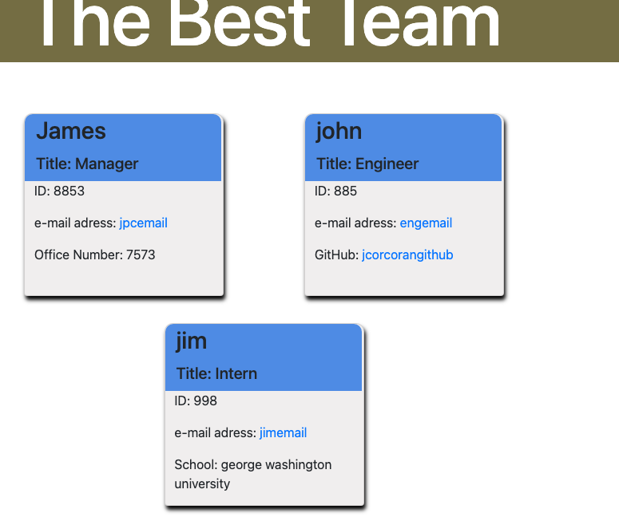
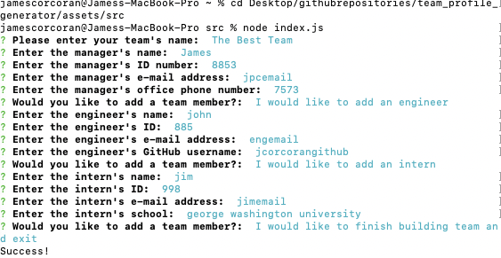
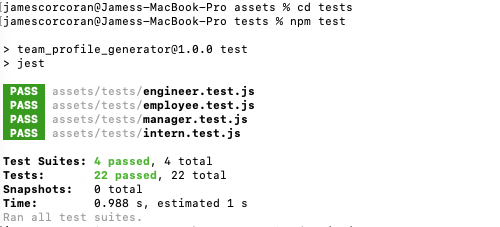

# team_profile_generator

## Description
The purpose if this assignment is to build a Node.js command-line application that takes in information about employees on a software engineering team, then generates an HTML webpage that displays summaries for each person. Due to the importance of testing, unit tests will be written for every part of this code. 

link to github repo:
https://github.com/jcorcorangithub/team_profile_generator

link to video
https://drive.google.com/file/d/1Te_rf8KcoK6w1hy2klLBrt97Ik6TZys9/view

## Technologies
JavaScript
Node Inquirer
Node fs
Node Jest

## Contributors
I will be the sole contributor of this project 

## Contact
Name: James Corcoran 
email: jpcsoccer1234@gmail.com

